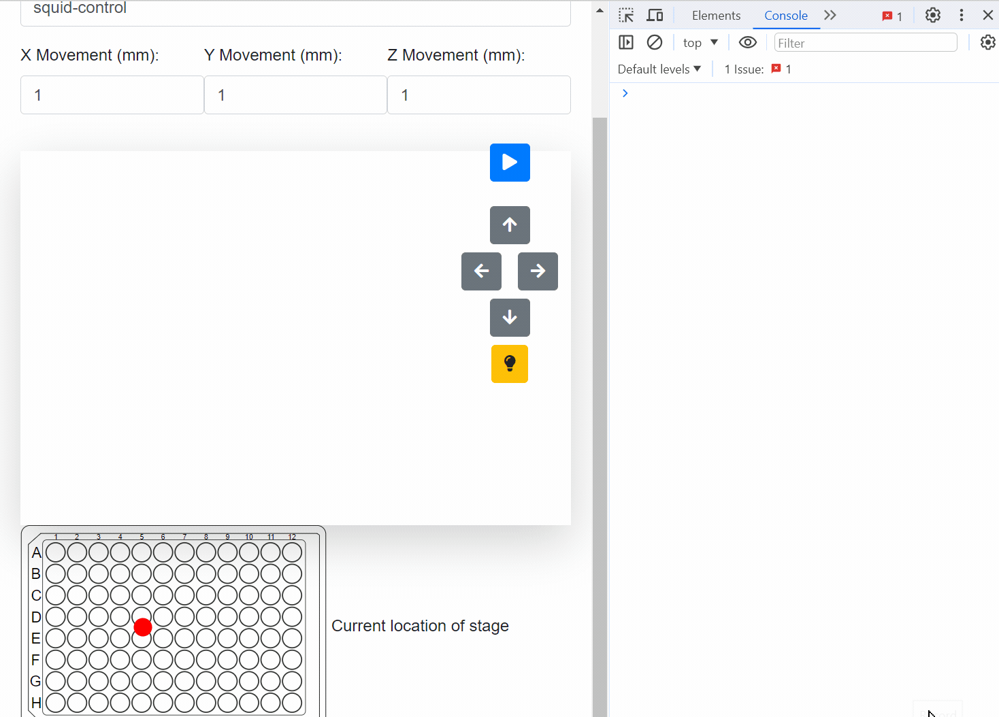

# Squid Microscope Control Code

## Overview
This repository contains the control code for the Squid microscope, a part of the REEF Imaging Farm project. It is a modified version of a project initially developed by Hongquan Li, available [here](https://github.com/hongquanli/octopi-research).

- Web GUI for Squid Microscope: [REEF WebRTC](https://github.com/aicell-lab/reef-webrtc)

### Key Features:
- Controls the Squid microscope for the [REEF Imaging Farm project](https://aicell.io/project/reef-imaging-farm/).
- Integrates with the Hypha server for service registration and remote monitoring. More details can be found in these [slides](https://slides.imjoy.io/?slides=https://raw.githubusercontent.com/oeway/slides/master/2022/i2k-2022-hypha-introduction.md#/5).
- Provides a web GUI for users to watch the status of the microscope and take over control. The GUI is part of another project, which can be found [here](https://github.com/aicell-lab/reef-webrtc).

## Demonstration
Below is a demonstration of the Squid Microscope Web GUI in action:

## Installation and Usage
(Here, you can provide detailed instructions on how to install and use the control code for the Squid microscope. Include any prerequisites, dependencies, and step-by-step guides.)

## Acknowledgements
- Original project by Hongquan Li: [OCToPi Research](https://github.com/hongquanli/octopi-research)
- REEF Imaging Farm project: [REEF Imaging Farm](https://aicell.io/project/reef-imaging-farm/)
- Hypha server introduction slides: [Hypha Introduction](https://slides.imjoy.io/?slides=https://raw.githubusercontent.com/oeway/slides/master/2022/i2k-2022-hypha-introduction.md#/5)

